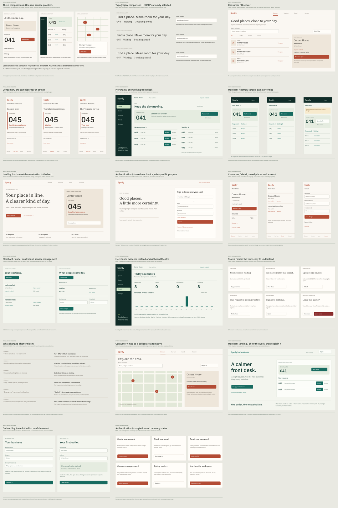

# Spotly frontend — resolved design handoff

**Design completed and final handoff reviewed: 12 September 2026. The approved implementation is now applied in the working tree; live release validation remains separate.**

Read in this order:

1. [Visual atlas: 17 boards](SPOTLY_DESIGN_ATLAS.pdf) — competing compositions, typography, final screens, responsive states and revision decisions.
2. [Design decisions](DESIGN_DECISIONS.md) — evidence, criticism, selected system and rejected alternatives.
3. [Screen and behavior specification](SCREEN_SPECIFICATION.md) — exact page structure, state rules, API boundaries and route map.
4. [Implementation plan](IMPLEMENTATION_PLAN.md) — ordered work packages, dependencies and acceptance checks. This is an execution handoff, not a request for more design exploration.

## Status and authority

These are static design documents and visual studies, not a functioning application or usability-test results. They complete the design recommendation and engineering handoff requested in this conversation. They do not claim deployment, live auth validation, or production readiness.

User instructions take precedence. Within this handoff, SCREEN_SPECIFICATION controls behavior and IMPLEMENTATION_PLAN controls execution order. DESIGN_DECISIONS controls tokens and visual rules. Atlas drawings establish composition; use specified CSS values rather than measuring scaled pixels in the PDF. Decorative grey board headers are presentation framing, not product UI. Wordmark/icon positions are reserved; reuse the existing Spotly mark and Lucide icons rather than tracing generated branding.

The earlier `implementation_plan.md` remains untouched as reviewed source material. Earlier generated Terracotta/Jade images informed the direction but contain rejected behavior and wording. They are not implementation specifications. The prior uncommitted preview was superseded by the isolated P11 collection; the current preview route is development-only evidence, not a production surface.

The implementation pass now includes the approved consumer and merchant shells, auth lifecycle, queue workflows, supporting outlet/service/account surfaces and the isolated development-only interface collection. This documentation remains the visual and behavioral authority; it does not claim deployment or live-service verification.

## What is decided

- Terracotta consumer: place discovery, precise queue status, approachable editorial headings.
- Jade merchant: one operational queue workspace, compact navigation, simultaneous requests and waiting lists on wide screens.
- IBM Plex Sans for UI; IBM Plex Serif only for consumer editorial headings.
- List-first discovery; map is an alternate mode, not a separate primary destination.
- Auth has dedicated routes and role-specific copy; browsing does not require login.
- Preserve actual reviews, favorites, menus, outlets and account capabilities. Remove unsupported settings from primary navigation.
- No invented ETA, arrival status, ranking, customer names in public queues, ratings, notification guarantees, or analytics.
- Two narrowly specified supporting API changes: menu-item editing and protection against deleting outlets with active entries. No platform rewrite.

## Evidence limits

This pass re-read relevant source, contracts and prior supplied/generated images; consulted current primary references; drew and inspected static design boards. Earlier live public-page observations are historical context, not fresh authenticated audit evidence. Protected workflows were specified from source. No customer usability sessions were performed. The current deployment's authentication configuration, email delivery and realtime reliability remain release-validation questions, not design choices left to the implementing agent.

## Changes made in this pass

This documentation directory was created during the design pass. The subsequent implementation pass changed the approved app, shared UI, type and server files while preserving unrelated work. Nothing was committed, pushed or deployed.

## Design-package validation

- **PASS:** 17 boards saved and included in the PDF; representative PDF output rendered successfully.
- **PASS:** local links checked; selected text/action contrast pairs calculated; specification and route/API coverage reviewed.
- **Corrected during review:** auth navigation simplified to brand/back link; compact frame labels corrected; destructive confirmation includes safe cancel and uses error color.
- **Not claimed:** implemented responsiveness, live authentication/realtime, user-testing results or runtime accessibility compliance. Those remain explicit implementation acceptance tests.

The PDF contains static image-based boards, not tagged/selectable screen text. The accompanying Markdown supplies searchable text specifications and exact values. Sample screen dates intentionally remain 11 September to preserve the original scenario. Small icon placeholders in exploration sketches are not production assets; use Lucide as specified.

## September 13 maintainer refinement

The user's later visual reference explicitly adds dark navigation/current-visit surfaces, a distinctive Spotly mark, and warm architectural photography throughout the working product. See [MAINTAINER_REVIEW.md](MAINTAINER_REVIEW.md) for this approved composition refinement and honest final verification evidence. The Terracotta/Jade roles, fonts, server-authoritative behavior, and static-export architecture remain in place. The old design-preview is labeled historical; final QA renders the actual production routes.
