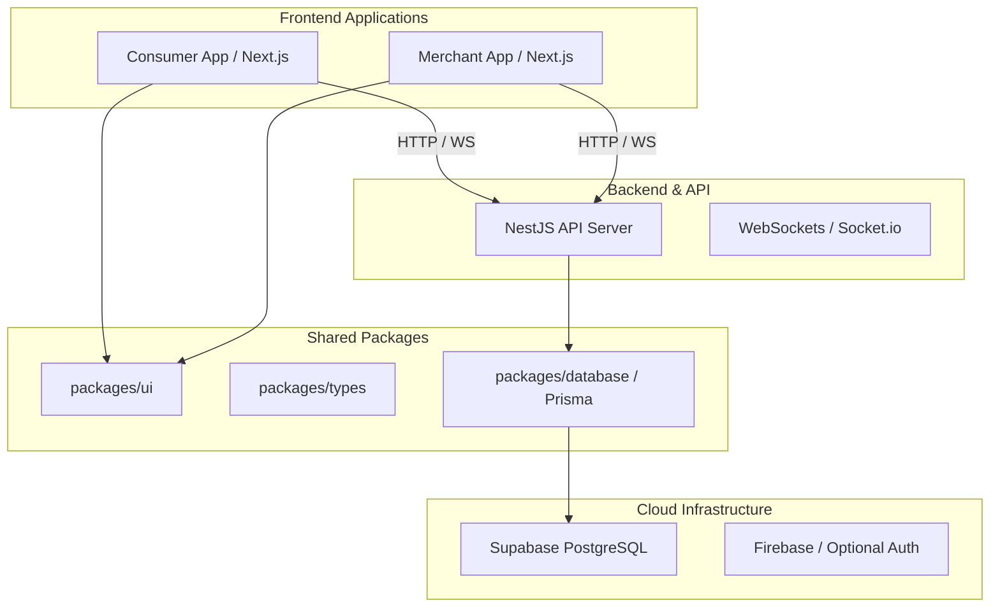

# Spotly Master Implementation Plan & System Architecture

This document describes the comprehensive, production-grade architecture and execution plan for Spotly, bridging the conceptual frontend/UI designs with a robust backend architecture utilizing Prisma, Supabase, and NestJS in a Turborepo monorepo.

## 1. System Architecture Overview

Spotly is structured as a **Turborepo Monorepo** encompassing dual Next.js applications (for Consumer and Merchant) and a single NestJS backend API.

> [!NOTE] 
> We are transitioning to **Supabase + Prisma** for all relational data to ensure scalability and strong typing across our applications.



### Key Technical Stack

*   **Monorepo:** Turborepo, pnpm workspaces.
*   **Frontend (Apps):** Next.js 14+ (App Router), React, Tailwind CSS, Framer Motion, Zustand (State Management), Lucide-React (Icons).
*   **Shared UI:** Shared React components `packages/ui` for consistency across Consumer & Merchant apps.
*   **Backend API:** NestJS (Express under the hood), WebSockets (`@nestjs/websockets`), Class Validator.
*   **Database:** Supabase PostgreSQL initialized via Prisma ORM (`packages/database`).
*   **Authentication:** Supabase Auth (or integrating existing Firebase Auth depending on business preference, with Prisma storing user metadata).

---

## 2. UI/UX & Frontend Architecture

The frontend is built for visual excellence, taking strong inspiration from `UI_UX_IMPLEMENTATION_GUIDE.md` and `spotly_professionalized.txt`.

### Design System Principles
*   **Themes:** Emerald Green (`#22c55e`) for Merchants; Golden/Orange Gradient (`#facc15` to `#ff6b35`) for Consumers.
*   **Typography:** 'Outfit' / 'Syne' for bold, expressive headings, 'Inter' for highly readable body copy.
*   **Aesthetics:** Dark mode heavily utilizing glass-morphism (`backdrop-filter`), smooth glow effects, interactive micro-animations native to Framer Motion.
*   **Performance:** Using React Server Components for fast initial loads, with heavy interactions client-side via `use client`.

### Shared UI Package (`@spotly/ui`)
Creating a dedicated UI library will allow us to share all aesthetic components across both consumer and merchant platforms, guaranteeing the lag-free, premium experience:
*   `Button`, `Card` (with glass-morphism hover lifts), `Input` (floating labels), and `Badge` variants.
*   High-order layout structures like `ToastProvider` and custom `AnimationWrapper` components.

---

## 3. Database Schema (Prisma)

A new `packages/database` package will house the Prisma schema and the generated Prisma Client.

```prisma
generator client {
  provider = "prisma-client-js"
}

datasource db {
  provider = "postgresql"
  url      = env("DATABASE_URL")
}

model User {
  id        String   @id @default(uuid())
  phone     String?  @unique
  name      String?
  role      Role     @default(CONSUMER)
  createdAt DateTime @default(now())
  updatedAt DateTime @updatedAt

  queues    QueueEntry[]
  reviews   Review[]
}

model Merchant {
  id          String   @id @default(uuid())
  ownerId     String   @unique
  name        String
  category    String
  description String?
  verified    Boolean  @default(false)
  outlets     Outlet[]
}

model Outlet {
  id          String   @id @default(uuid())
  merchantId  String
  merchant    Merchant @relation(fields: [merchantId], references: [id])
  name        String
  address     String
  lat         Float?
  lng         Float?
  isActive    Boolean  @default(true)
  
  queues      QueueEntry[]
}

model QueueEntry {
  id        String   @id @default(uuid())
  userId    String
  user      User     @relation(fields: [userId], references: [id])
  outletId  String
  outlet    Outlet   @relation(fields: [outletId], references: [id])
  token     Int
  status    QueueStatus @default(WAITING) // WAITING, CALLED, SERVED, CANCELLED
  createdAt DateTime @default(now())
}

model Review {
  id          String   @id @default(uuid())
  userId      String
  user        User     @relation(fields: [userId], references: [id])
  outletId    String
  rating      Int
  comment     String?
  createdAt   DateTime @default(now())
}

enum Role {
  CONSUMER
  MERCHANT
  ADMIN
}

enum QueueStatus {
  WAITING
  CALLED
  SERVED
  CANCELLED
}
```

---

## 4. Master Execution Plan

Here is the step-by-step roadmap for implementation.

### Phase 1: Foundation & Monorepo Restructuring
- [ ] Initialize `packages/database` with Prisma.
- [ ] Setup Supabase PostgreSQL connection in `.env`.
- [ ] Run `npx prisma db push` to generate schemas in Supabase and generate Prisma Client.
- [ ] Create `packages/ui` using `tsup` configured for React. Add Tailwind CSS and Framer Motion dependencies.
- [ ] Hook `@spotly/database` and `@spotly/ui` into `apps/api`, `apps/consumer`, and `apps/merchant` as workspace dependencies.

### Phase 2: Backend API Core & Real-time setup
- [ ] Instantiate `PrismaService` inside `apps/api`.
- [ ] Develop REST endpoints for `MerchantController`, `OutletController` and `UserController` inside NestJS.
- [ ] Initialize `@nestjs/websockets` Gateway for real-time queue syncing. This WebSocket channel will broadcast `{ event: "QUEUE_UPDATED", data: {...} }` payloads when QueueEntry rows change in Prisma.
- [ ] Implement Auth Guards (verifying JWTs provided by Supabase/Firebase Auth).

### Phase 3: The Consumer App UI/UX
- [ ] Setup standard layout using Tailwind CSS.
- [ ] Implement the `Landing Page`, with glowing orb animations via Framer Motion, ticker carousels, and visual hero section.
- [ ] Develop the Consumer Home/Browse view with robust glass-morphic merchant cards and sorting/filtering controls.
- [ ] Implement the Live Queue tracker view, establishing WebSocket connections to stream ETA & position updates.
- [ ] Integrate the OTP-based or Google Auth based login flow on the client.

### Phase 4: The Merchant App UI/UX
- [ ] Implement the Merchant Dashboard UI (focusing on Emerald Green `#22c55e` styling).
- [ ] Create real-time "Outlet queue management" control panels (to Call, Serve, or Cancel tokens).
- [ ] Implement statistical analytics charts to overview daily footfalls, average wait times, and satisfaction ratings.
- [ ] Outlet profiling pages to customize hours, add maps via coordinate mapping, and change statuses.

### Phase 5: Polish, Optimization & Launch Prep
- [ ] Ensure `<AnimatePresence>` is widely utilized for smooth page transitions between routes in Next.js.
- [ ] Ensure Lucide icons are used uniformly across all UI elements instead of native emojis for consistent aesthetics.
- [ ] Add Global Toast notifications on action events (e.g., "Queue Joined", "Token Called!").
- [ ] Run load testing on NestJS connection pooling to Prisma.
- [ ] Prepare `render.yaml` or Docker deployment configurations for the NestJS API and Vercel/Railway deployments for the Next.js apps.

---

## 5. Open Questions

> [!WARNING] 
> User Review Required
> We possess a Supabase connection string. Prisma will automatically map models to relations.
> **Confirm:** Do you want to rely on existing `firebase-admin` for authentication (and sync Firebase users to Postgres `User` tables), or purely migrate to Supabase Auth entirely?

## 6. Verification Plan
*   **Database:** Verify `migrations` directory generates successfully via `prisma migrate dev`. Check Supabase dashboard to verify tables.
*   **API:** Fire Postman/cURL queries to test CRUDs on `Outlets` and `Queues`. Test Websockets via simple socket.io client script.
*   **Apps:** Ensure both Merchant and Consumer Next.js apps compile locally using `pnpm dev`. Run visual QA checks against the `UI_UX_IMPLEMENTATION_GUIDE.md` specifications.
